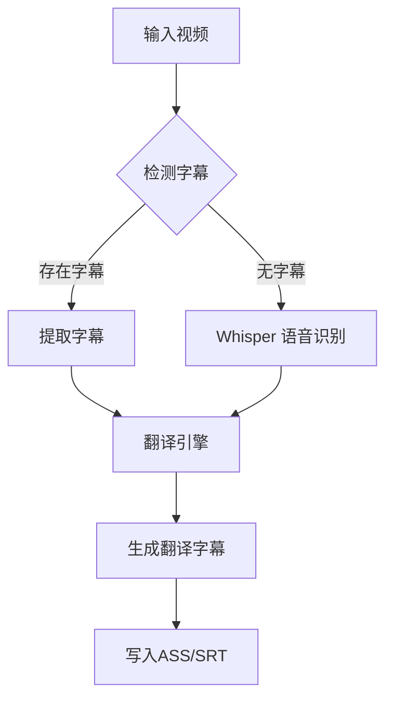

# AnimeTranslator 🎥🔤  

高效、智能的番剧字幕翻译工具，支持多种格式，保留原始字幕样式，并提供灵活的翻译配置。  

## ✨ 功能特性  

- **📌 智能字幕识别**  
  - 自动提取内嵌字幕/外挂字幕  
  - 兼容 `.mkv` `.mp4` `.ass` `.srt` 等格式  

- **🖋️ 原始样式保留**  
  - 兼容 ASS/SSA 字幕的特效与排版  
  - 生成翻译后的 SRT 或保留 ASS 样式  

- **🤖 多模态翻译方案**  
  - 直接翻译现有字幕文件（SRT/ASS）  
  - 无字幕时，自动调用 **OpenAI Whisper** 生成字幕  
  - 兼容 OpenAI API 标准接口，支持 GPT 翻译  

- **⚙️ 灵活配置**  
  - 自定义 **OpenAI API** 终端节点和密钥  
  - 可选 Whisper 语音识别模型  

## 📦 安装指南  

### 1️⃣ 环境要求  

- **Python 3.9+**  
- **FFmpeg**（用于提取字幕）  
- **[可选] NVIDIA GPU**（加速语音识别）  

### 2️⃣ 安装依赖  

```bash
pip install -r requirements.txt
```

## 🚀 快速配置  

### **首次运行**  
执行程序后，`config.yml` 配置文件将自动生成。  

### **手动编辑 `config.yml`**  

```yaml
openai:
    api_key: "your-api-key-here"
    api_base: "https://api.openai.com/v1"
    model: "gpt-4"

whisper:
    model_size: "large-v2"
    language: "ja"
```

📌 **配置说明**：  
- 替换 `"your-api-key-here"` 为你的 **OpenAI API Key**  
- 若使用自定义 OpenAI API 地址，修改 `api_base`  
- Whisper 模型可选：`tiny` / `base` / `small` / `medium` / `large-v2`  
- `language` 选项示例：`ja`（日语）、`en`（英语）  

## 📜 使用方式  

```bash
python main.py [视频文件路径]
```

## 🔄 工作流程  



## ⚠️ 注意事项  

1. **API 调用可能产生费用**，请合理使用  
2. 确保输入文件 **使用 UTF-8 编码**  
3. FFmpeg **需加入系统 PATH 环境变量**  
4. **ASS 样式保留** 仅适用于原始字幕格式为 ASS/SSA 的情况  

## 📜 许可证  

MIT License © Maple-Kaede 2025  